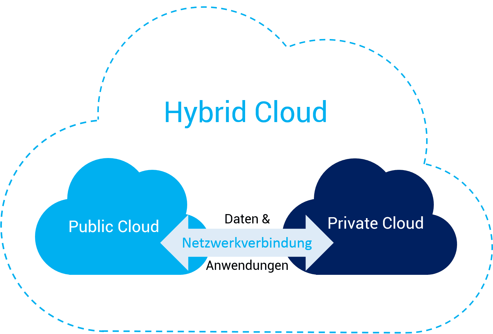

# Hybrid Cloud

**Definition:** Eine Hybrid-Cloud ist eine IT-Infrastruktur, die eine Kombination aus lokalen (OnPremise) und Cloud-basierten Ressourcen nutzt, um Flexibilität und Skalierbarkeit zu bieten.

**Vorteile:**
- Flexibilität, Workloads zwischen Cloud und lokalen Rechenzentren zu verschieben
- Kostenkontrolle
- Sicherstellung der Datensicherheit bei sensiblen Informationen

**Beispiel:** Kombination aus Amazon Web Services (AWS) und lokalen Servern

 <!-- Beispiel für ein Bild -->
